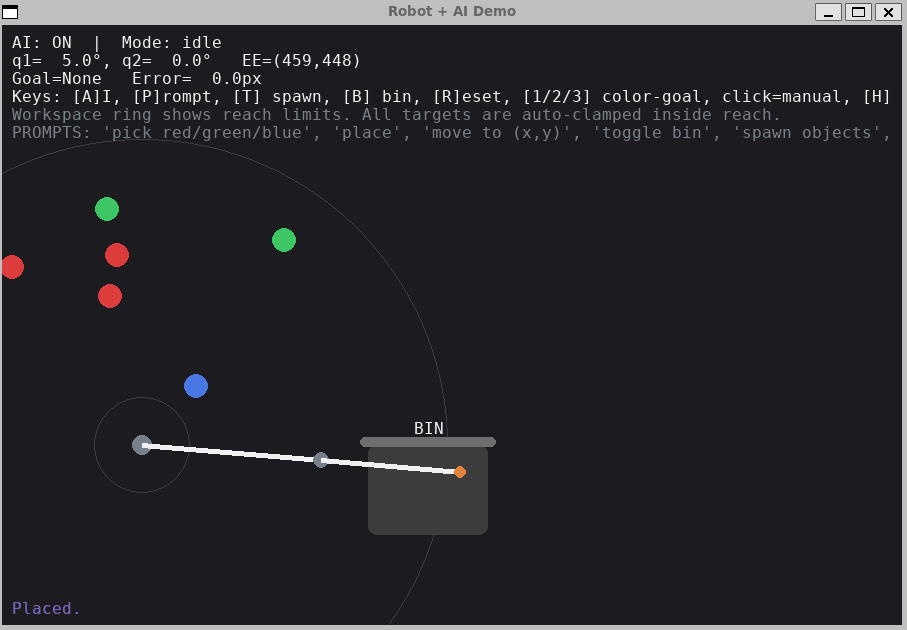

# 🤖 Robot + AI 

一个用 **Pygame** 编写的交互式机器人与AI演示程序，展示了一个二维两连杆机械臂如何通过简单的文本指令进行物体抓取与放置。  
此版本特别增加了**可达范围约束（Reach-Safe）** 与**自动目标投影机制**，保证所有目标点、物体和料箱都在机械臂可达区域内。

---

## 🌟 功能亮点

### 🦾 1. 二维机械臂控制
- 使用 **雅可比转置法 (Jacobian-Transpose)** 实现逆运动学 (IK) 控制；
- 限制关节角范围与角速度；
- 通过软阻尼和比例增益实现平滑运动。

### 🧠 2. “AI”文本控制接口
- 内置轻量级指令解析器，可响应以下自然语言式命令：
  ```
  pick red / pick green / pick blue
  place
  move to (x, y)
  toggle bin
  spawn objects
  reset
  ```
- 模拟视觉-语言-行动 (VLA) 模型的任务规划行为。

### 🎯 3. 可达区域安全约束 (Reach-Safe)
- 程序自动检测并限制目标点、物体生成位置在机械臂的**环形可达区域**内；
- 鼠标点击或AI命令产生的目标均被自动投影到安全区域；
- 画面上实时绘制出最小/最大可达半径。

### 🗑️ 4. 场景元素优化
- “料箱 (Bin)” 自动生成在机械臂可达边缘；
- 随机生成的彩色物体自动分布在安全范围内；
- 抓取与放置逻辑完善：接近阈值自动抓取，靠近料箱自动放置。

---

## 🕹️ 交互控制说明

| 操作键 | 功能说明 |
|--------|-----------|
| **鼠标左键** | 设定手动目标点（会被自动投影到可达范围内） |
| **A** | 开/关 AI 自动规划模式 |
| **P** | 打开文本输入窗口，输入命令 |
| **T** | 随机生成彩色物体（红/绿/蓝） |
| **B** | 显示/隐藏料箱 |
| **R** | 重置场景 |
| **1 / 2 / 3** | 锁定目标为最近的红 / 绿 / 蓝物体 |
| **H** | 显示或隐藏帮助信息 |
| **ESC** | 退出程序 |

---

## 💬 示例命令

| 指令 | 功能 |
|------|------|
| `pick red` | 抓取最近的红色物体 |
| `pick blue` | 抓取最近的蓝色物体 |
| `place` | 将当前抓取的物体放入料箱 |
| `move to (600,350)` | 移动末端到指定坐标（自动限制在可达范围内） |
| `toggle bin` | 显示或隐藏料箱 |
| `spawn objects` | 重新生成随机物体 |
| `reset` | 重置整个场景 |

---

## 🛠️ 环境配置与运行

### 1️⃣ 安装依赖
确保安装 Python ≥ 3.8  
然后在终端运行：

```bash
pip install pygame
```

### 2️⃣ 运行程序
将脚本保存为：
```
robot_ai_pygame_reachsafe.py
```

运行命令：
```bash
python robot_ai_pygame_reachsafe.py
```

启动后会显示机械臂、随机物体和料箱的仿真窗口。

---

## 🧩 程序结构概览

```
robot_ai_pygame_reachsafe.py
├── Arm2D              # 二连杆机械臂类 (含 FK 与 IK)
├── Item / Bin         # 场景元素定义
├── AIController       # 文本指令解析与规划器
├── RobotAIDemo        # 主游戏循环与渲染逻辑
│   ├── project_into_workspace()  # 点投影至安全可达环
│   ├── spawn_random_objects()    # 随机物体生成
│   ├── draw_workspace()          # 可达范围绘制
│   ├── try_pick_or_place()       # 自动抓取/放置
│   └── mainloop()                # 主循环与交互事件
└── main()            # 程序入口
```

---

## 🧠 技术要点

- **语言**：Python 3.8+
- **依赖库**：Pygame
- **算法**：Jacobian Transpose IK + 动态阻尼
- **输入方式**：键盘 / 鼠标 / 文本命令
- **输出**：实时可视化的机械臂运动与任务执行状态

---

## 📈 可扩展方向

- 🔗 **ROS 2 集成**：发布末端轨迹或关节角度话题；
- 🌐 **网络通信**：通过 UDP/TCP 与真实控制器交互；
- 🧩 **AI策略替换**：集成强化学习、VLM 或 GPT 控制逻辑；
- 🎥 **视觉感知**：结合相机识别真实物体与颜色；
- 🧱 **物理仿真**：加入 PyBullet / Isaac Sim 碰撞检测模块。

---

## 📸 运行效果示意




---

## 👤 作者信息
**Author:** Z.Ding - AHPU
**Date:** 2025-10-21  
**License:** MIT
